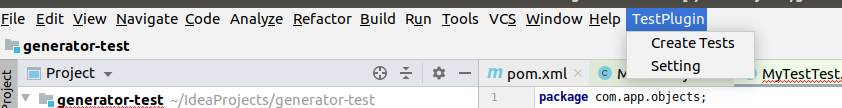
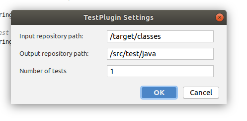

# unit-test-generator

Gradle version - 6.5

Для запуска проверки генерации на покрытие:

1) run "gradle fatJar"
2) run "docker container prune"
3) run "docker run -v /home/path/to/project/name/:/home/name --name testgen -it dockercontainervm/junitcontest:test"
5) run "cd home/name"
4) run "./runGeneration"

Статистика в ./stats_log.txt

--------------------------------------------------------------------------------------------------------------------

Для запуска среды разработки со встроенным плагином:

1) run "gradle runIde"

По результату откроется среда разработки со встроенным плагином.

Плагин сам отражается на панели инструментов сверху.

В рамках меню есть опция создания тестов и настройки для плагина.

--------------------------------------------------------------------------------------------------------------------

В настройках плагина задается путь, где лежат скомпилированные файлы. 
Путь, куда нужно будет расположить сгенерированные тесты и
количество тестов на 1 метод. 

Все пути являются относительными по отношению к папке проекта.

